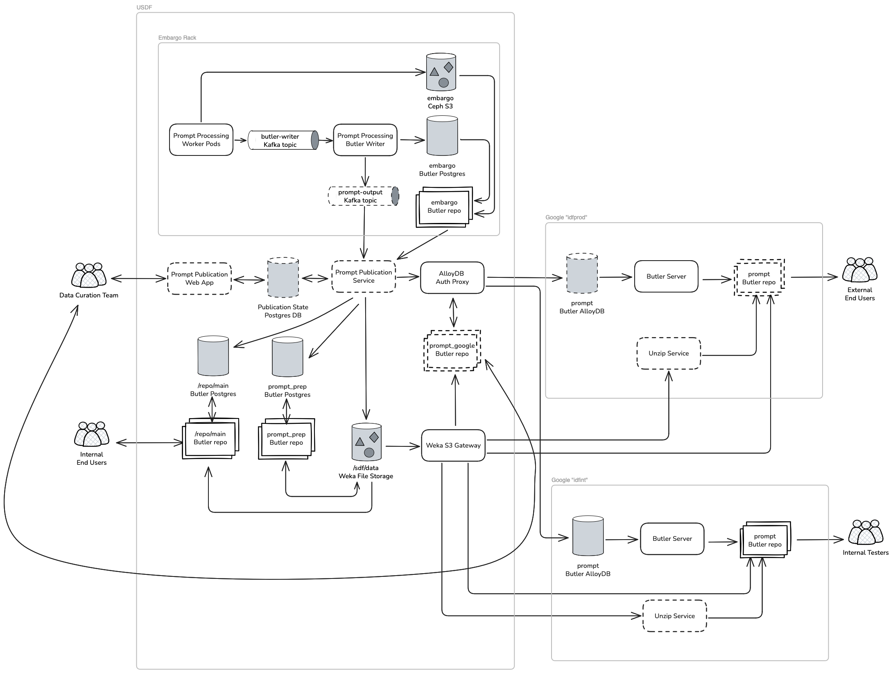

# Publication flow for Butler prompt data products

```{abstract}
Describes the infrastructure supporting the end-user prompt data products Butler repository and the process of making data available in it.
```

## System Overview



## Lifecycle of Prompt Processing outputs

Prompt processing pods:

1. Generate outputs in a local Butler repository
2. Copy files to central `embargo` Butler repository S3
3. Write file metadata to Kafka for consumption by writer service

[Prompt Processing Butler Writer](https://dmtn-310.lsst.io/)

4. Read file metadata from Kafka and write it to central `embargo` Butler repository Postgres
5. Write list of output datasets to Kafka for consumption by publication service

Prompt Publication Service:

6. Read list of datasets to unembargo from Kafka
7. Unembargo files and metadata from `embargo` to `prompt_prep` Butler repository
8. Copy metadata from `embargo` to `/repo/main` Butler repository (files shared with `prompt_prep`)
9. Delete files from `embargo` Butler repository
10. Copy metadata from `prompt_prep` to end-user Butler AlloyDB at Google
11. "Unpublish" metadata from end-user Butler AlloyDB when datasets expire
12. Delete files from `prompt_prep` Butler repository
13. Delete files from `/repo/main` Butler repository

## Butler Collection Structure

```
Prompt/All
    Prompt/Available              CHAINED
        LSSTCam/raw/all           RUN
        Prompt/Outputs/Current    TAGGED
        Prompt/Calibs             CHAINED
            ... replicate calibration chain structure from embargo ...
    Prompt/Outputs/Expired        TAGGED
```